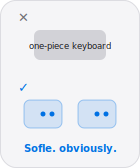

<table>
<tr>
<td valign="top">

# Hey, I'm Abinash.

**I build backend software.**

Java at Mindgate by day. Payments, banking, the unglamorous stuff that has to work. Go and TypeScript experiments when the laptop stays open after hours.

[Portfolio](https://theabx.in) · [Email](mailto:abinash@theabx.in) · [LinkedIn](https://linkedin.com/in/abinash-selvarasu) · [Resume](https://theabx.in/abinash_selvarasu_resume.pdf)

 

India · Open to chat · Spring Boot at work · Golang after hours

</td>
<td width="140" align="right" valign="top">

</td>
</tr>
</table>

 

---

EXPERIENCE

### The day job.

Java developer at [Mindgate Solutions](https://www.mindgate.solutions/), building tax-payment products and internal banking tools.

KEYBOARD

### Split keebs.

I type on split keyboards. Sofle is the daily driver — because apparently a normal rectangle was too easy. Column stagger, thumb clusters, and a keymap I'll change again next week.

 

<picture>
  <source media="(prefers-color-scheme: dark)" srcset="https://github-readme-activity-graph.vercel.app/graph?username=AbiXnash&theme=github-compact&hide_border=true&area=true&height=130&hide_title=true&bg_color=000000&color=86868b&line=2997ff&point=2997ff&area_color=2997ff" />
  <source media="(prefers-color-scheme: light)" srcset="https://github-readme-activity-graph.vercel.app/graph?username=AbiXnash&theme=neutral&hide_border=true&area=true&height=130&hide_title=true&bg_color=ffffff&color=6e6e73&line=0071e3&point=0071e3&area_color=0071e3" />
  
</picture>