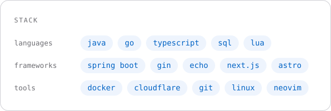
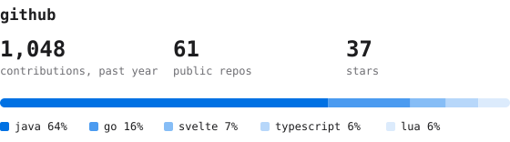

backend dev. java at [mindgate](https://www.mindgate.solutions/), so payments and banking. thrilling stuff.

go after hours, because rest is for people with fewer side projects.

types on a split keyboard. has rewritten the neovim config four times. will do it again.

somewhere between the bugs and the late nights, i found joy in programming. still here for it.

[theabx.in](https://theabx.in) · [email](mailto:abinash@theabx.in) · [linkedin](https://linkedin.com/in/abinash-selvarasu) · [resume](https://theabx.in/abinash_selvarasu_resume.pdf)
